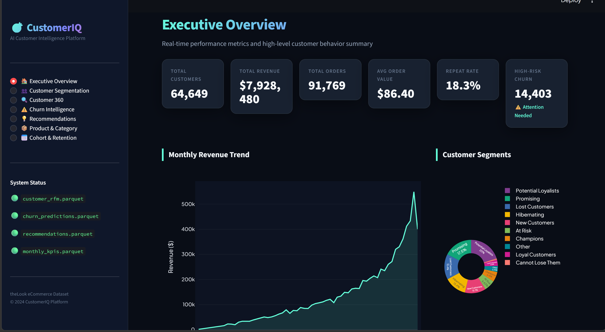
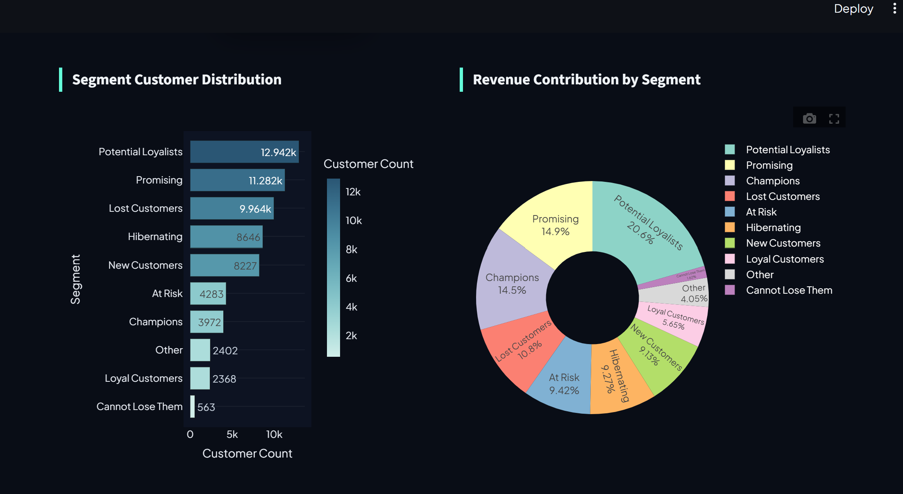
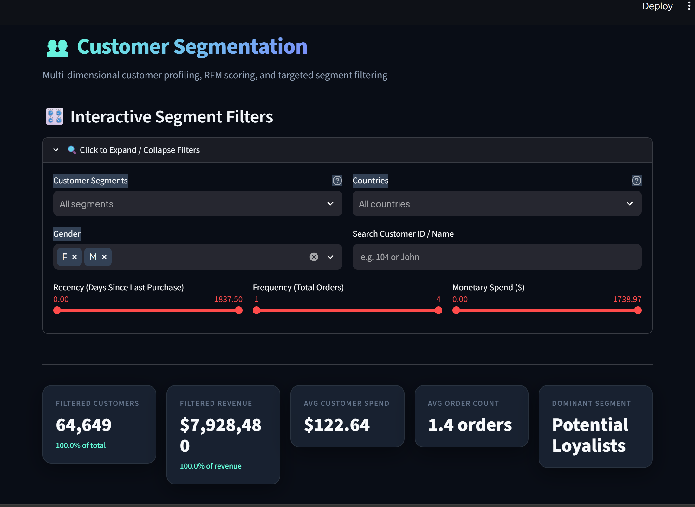
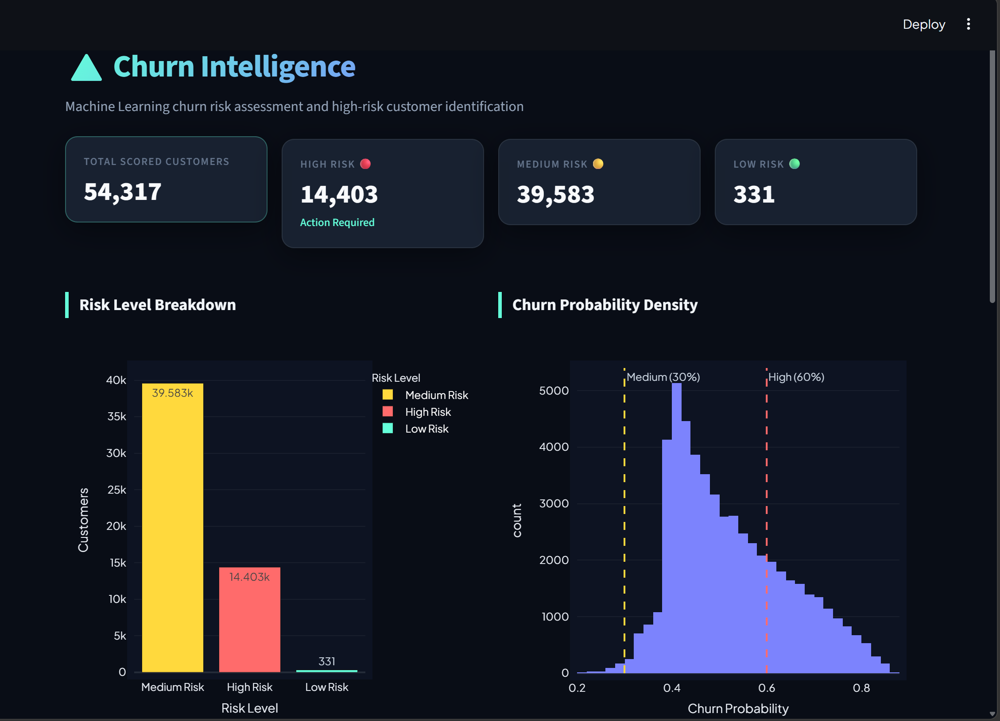

# CustomerIQ

**AI-Powered Customer Analytics, Segmentation, Recommendation & Churn Prediction Platform**

🔗 **[Live Demo](https://customeriq-dashboard.streamlit.app/)**

---

## Overview

CustomerIQ is a complete, production-grade data science and machine learning portfolio project built on the **theLook eCommerce dataset**. It transforms raw e-commerce data into actionable customer intelligence through:

- Customer segmentation (RFM + KMeans)
- Churn prediction (Logistic Regression + Random Forest)
- Personalised product recommendations
- Customer lifetime value estimation
- Cohort & retention analysis
- Monthly KPI tracking
- Product & category performance analytics
- An interactive Streamlit dashboard

---

## Problem Statement

Modern e-commerce businesses generate enormous volumes of customer data but struggle to extract actionable intelligence from it. CustomerIQ addresses this by providing:

1. **Who are my best customers?** → RFM segmentation
2. **Which customers are about to churn?** → ML churn prediction
3. **What should I recommend to each customer?** → Collaborative filtering recommendations
4. **How much is each customer worth?** → CLV estimation
5. **Are my cohorts retaining well?** → Cohort analysis

---

## Business Objectives

- Reduce customer churn by identifying at-risk customers early
- Increase revenue through personalised recommendations
- Optimise marketing spend by targeting the right segments
- Track business health through monthly KPIs
- Understand product and category performance

---

## Features

| Feature | Description |
|---------|-------------|
| 🔍 RFM Analysis | Recency, Frequency, Monetary scoring per customer |
| 👥 Segmentation | 9 business segments (Champions, Loyal, At Risk, etc.) |
| 🤖 Churn Prediction | Binary classification with probability and risk level |
| 💡 Recommendations | Segment-based collaborative filtering with explanations |
| 💰 CLV Estimation | Transparent formula: AOV × annual_freq × horizon_years |
| 📅 Cohort Analysis | Retention matrix by acquisition cohort |
| 📊 KPI Dashboard | Monthly revenue, orders, new/repeat customers |
| 📦 Product Analytics | Revenue and volume by category and product |
| 🔮 Customer 360 | Full customer profile in one view |

---

## Architecture

```
Raw Data (CSV/Parquet)
    ↓
Data Loader → Data Validator → Preprocessing
    ↓
DuckDB (analytical queries)
    ↓
Feature Engineering → RFM → Segmentation → CLV
    ↓
Churn Features → ML Training → Predictions
    ↓
Recommendations → Cohort Analysis → Monthly KPIs
    ↓
Output Parquet Files (data/output/)
    ↓
Streamlit Dashboard (dashboard/app.py)
```

---

## Data Flow

1. Raw CSV/Parquet files are loaded from `data/raw/`
2. Validation checks column presence, data types, referential integrity
3. Preprocessing cleans dates, nulls, duplicates
4. DuckDB tables are created for SQL-based analytics
5. Feature engineering builds customer-level aggregates
6. Segmentation assigns RFM scores and business labels
7. Churn model is trained on historical features, labels from a future window
8. Recommendations are generated from purchase patterns
9. All outputs saved to `data/output/` as Parquet
10. Streamlit dashboard reads from `data/output/`

---

## Dataset

**theLook eCommerce** — synthetic e-commerce dataset from Google (BigQuery Public Data).

| Table | Description |
|-------|-------------|
| `users` | Customer profiles (demographics) |
| `orders` | Order headers (status, date) |
| `order_items` | Line items with sale_price |
| `products` | Product catalog (category, brand, price) |
| `events` | Clickstream events |
| `inventory_items` | Inventory and cost |
| `distribution_centers` | Warehouse locations |

See `data/raw/README.md` for download instructions.

---

## Technology Stack

| Technology | Purpose |
|-----------|---------|
| Python 3.10+ | Core language |
| Pandas | Data manipulation |
| NumPy | Numerical computing |
| DuckDB | In-process analytical SQL |
| PyArrow | Parquet I/O |
| Scikit-learn | ML models, preprocessing, evaluation |
| Joblib | Model persistence |
| Streamlit | Interactive dashboard |
| Plotly | Interactive visualisations |
| Pytest | Testing |

---

## Project Structure

```
CustomerIQ/
│
├── data/
│   ├── raw/           ← Place theLook dataset files here
│   │   └── README.md  ← Download instructions
│   ├── processed/     ← Intermediate data (auto-generated)
│   └── output/        ← Final analytics outputs (Parquet)
│
├── database/
│   └── customeriq.duckdb   ← Auto-created analytical database
│
├── src/
│   ├── config.py           ← All paths, parameters, constants
│   ├── data_loader.py      ← CSV/Parquet auto-detection
│   ├── data_validator.py   ← Pre-analytics data quality checks
│   ├── preprocessing.py    ← Cleaning and normalisation
│   ├── duckdb_manager.py   ← DuckDB connection and query execution
│   ├── feature_engineering.py  ← RFM, churn, customer aggregates
│   ├── segmentation.py     ← RFM scoring, segments, CLV, KMeans
│   ├── churn.py            ← Churn model training and predictions
│   ├── recommendation.py   ← Collaborative filtering recommendations
│   ├── analytics.py        ← Monthly KPIs, cohorts, product analytics
│   └── utils.py            ← Logging, Parquet I/O, timing
│
├── sql/
│   ├── rfm.sql
│   ├── cohort.sql
│   ├── monthly_kpis.sql
│   └── category_analytics.sql
│
├── dashboard/
│   └── app.py              ← Streamlit dashboard (7 pages)
│
├── models/                 ← Trained ML model artifacts
│
├── tests/
│   ├── test_data_validation.py
│   ├── test_rfm.py
│   ├── test_segmentation.py
│   ├── test_churn.py
│   └── test_recommendations.py
│
├── scripts/
│   └── generate_outputs.py
│
├── run_pipeline.py         ← Main pipeline entry point
├── requirements.txt
├── .gitignore
├── LICENSE
└── README.md
```

---

## Installation

### 1. Create a virtual environment

```bash
cd CustomerIQ
python -m venv venv
```

### 2. Activate the virtual environment

**Windows:**
```bash
venv\Scripts\activate
```

**macOS/Linux:**
```bash
source venv/bin/activate
```

### 3. Install dependencies

```bash
pip install -r requirements.txt
```

---

## Dataset Setup

1. Follow the instructions in `data/raw/README.md`
2. Place the theLook eCommerce tables in `data/raw/`
3. Files can be `.parquet` (preferred) or `.csv`

---

## Running the Pipeline

```bash
python run_pipeline.py
```

Expected output:
```
============================================================
  CUSTOMERIQ PIPELINE
============================================================

[1/14] Validating dataset...
[2/14] Loading raw data...
[3/14] Cleaning data...
...
[14/14] Exporting outputs...

============================================================
  CUSTOMERIQ PIPELINE COMPLETED SUCCESSFULLY
============================================================
```

---

## Running the Dashboard

```bash
streamlit run dashboard/app.py
```

Navigate to `http://localhost:8501` in your browser.

---

## Running Tests

```bash
pytest tests/ -v
```

Tests use synthetic data and do **not** require the real dataset.

---

## Machine Learning Methodology

### Churn Prediction

**Definition**: A customer is labelled "churned" if they made no purchase in the 90-day window following the feature cutoff date.

**Feature Window**: All historical orders before the cutoff date.  
**Prediction Window**: 90 days after the cutoff date.

**Why 90 days?** Balances identifying genuinely lost customers vs. normal purchase cycle gaps for e-commerce.

**Anti-leakage design**: Features are computed strictly from historical data. The churn label is derived from future data. These windows never overlap.

**Models**:
- Logistic Regression (baseline, interpretable coefficients)
- Random Forest (stronger, feature importance)

**Evaluation Priority**: ROC-AUC and Recall are prioritised because false negatives (missing a churning customer) have higher business cost in a retention campaign context.

**Validation**: Stratified train/test split (80/20) with fixed `random_state=42` for reproducibility.

---

## RFM Methodology

| Metric | Definition |
|--------|-----------|
| Recency | Days since the customer's most recent completed purchase |
| Frequency | Number of distinct completed orders |
| Monetary | Total revenue contribution (sum of sale_price from completed items) |

Scores 1–5 are assigned using quintile-based binning (qcut), where:
- R score: 5 = most recent (lowest recency)
- F score: 5 = most frequent
- M score: 5 = highest spender

---

## Segmentation Methodology

Two-layer approach:

1. **RFM Rule-Based** (primary): Deterministic rules on R/F/M scores. Fully explainable.
2. **KMeans Clustering** (supplementary): Identifies natural groupings. Clusters are mapped to business labels by value score.

---

## CLV Formula

```
Estimated CLV = AOV × annual_purchase_frequency × horizon_years

where:
  AOV = average order value (historical)
  annual_purchase_frequency = total_orders / tenure_years
  horizon_years = 2.0 (configurable in src/config.py)
```

This is clearly labelled as an **estimate**. It is not a guaranteed future value.

---

## Recommendation Methodology

1. Identify each customer's purchased categories and products.
2. For each customer's segment, find the most popular products among peers.
3. Rank unpurchased products by affinity score (normalised purchase count).
4. Every recommendation includes a human-readable explanation.
5. Fallback: overall platform popularity if segment data is sparse.

---

## Risk Thresholds

| Risk Level | Churn Probability |
|-----------|-------------------|
| Low Risk 🟢 | < 30% |
| Medium Risk 🟡 | 30% – 60% |
| High Risk 🔴 | ≥ 60% |

Configurable in `src/config.py`.

---

## Evaluation Metrics

| Metric | Why Used |
|--------|---------|
| Accuracy | Overall correctness |
| Precision | Of predicted churners, how many actually churned |
| Recall | Of actual churners, how many were caught |
| F1-Score | Harmonic mean of precision and recall |
| ROC-AUC | Ranking quality across all thresholds |

---

## Screenshots

| Dashboard Overview | Segment Distribution & Revenue |
|---|---|
|  |  |

| Interactive Segment Filters | Churn Predictions |
|---|---|
|  |  |

*Run `streamlit run dashboard/app.py` to explore the live dashboard.*

---

## Future Improvements

- Hyperparameter tuning (GridSearchCV / Optuna)
- Time-aware train/test split using `TimeSeriesSplit`
- More advanced recommendation algorithms (matrix factorisation)
- Prophet or ARIMA for revenue forecasting
- Customer journey analysis using event sequences
- Automated model retraining when new data arrives
- A/B test simulation for retention campaign ROI

---

## Interview Explanation Guide

**"How does your churn model work?"**

> I split customer history at a cutoff date. Features come from historical orders before the cutoff. The label is whether the customer bought anything in the next 90 days. I train Logistic Regression and Random Forest, selecting the best by ROC-AUC. The key design choice is avoiding data leakage: I never allow future purchase information into the feature set.

**"How did you define customer segments?"**

> I use RFM — Recency, Frequency, Monetary value. Each dimension is scored 1-5 using quintile-based binning. I then apply documented rules to map score combinations to business labels like "Champions" or "At Risk". The rules are fully transparent and can be explained to a non-technical stakeholder.

**"Why DuckDB?"**

> DuckDB is an in-process analytical database. It runs SQL on DataFrames without a server, making it ideal for local development on large datasets. It's much faster than Pandas for aggregations on millions of rows.

---

## License

MIT License — see [LICENSE](LICENSE)

---

*Built with Python, Pandas, DuckDB, Scikit-learn, and Streamlit.*
